

# Network Security Groups (NSGs) and Inspecting Traffic Between Azure Virtual Machines

In this tutorial, we observe various network traffic to and from Azure Virtual Machines with Wireshark as well as experiment with Network Security Groups.

> Environments and Technologies Used

- Microsoft Azure (Virtual Machines/Compute)
- Remote Desktop
- Various Command-Line Tools
- Various Network Protocols (ICMP, SSH, DHCP, DNS, RDP)
- Wireshark (Protocol Analyzer)

> Operating Systems Used

- Windows 10 (21H2)
- Ubuntu Server 20.04

> High-Level Steps

- Create Resources
- Observe ICMP Traffic
- Observe SSH Traffic
- Observe DHCP Traffic
- Observe DNS Traffic
- Observe RDP Traffic

## Actions and Observations

Set up your virtual environment

Create a Resource Group:

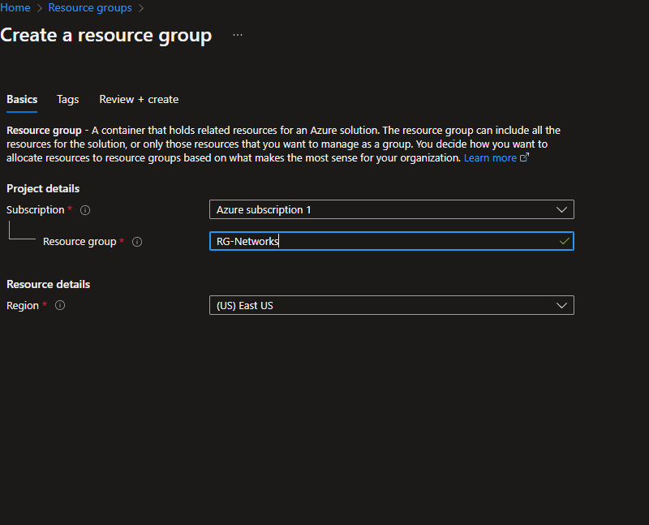

Create a Windows virtual machine.

While creating the VM, select the previously created Resource Group and allow it to create a new Virtual Network (Vnet) and Subnet. 
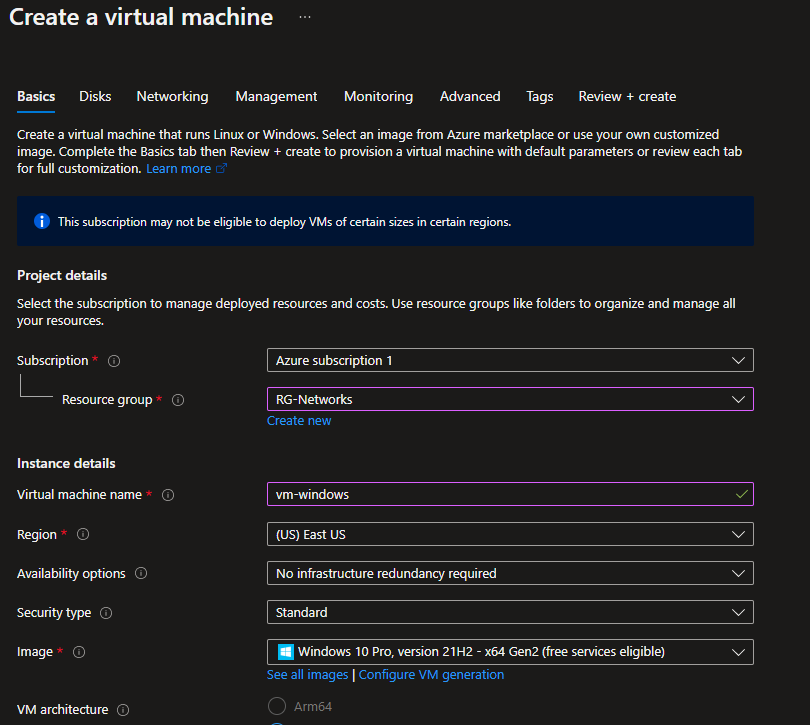

Create an Ubuntu virtual machine.

While creating the VM, select the previously created Resource Group and allow it to create a new Virtual Network (Vnet) and Subnet. 

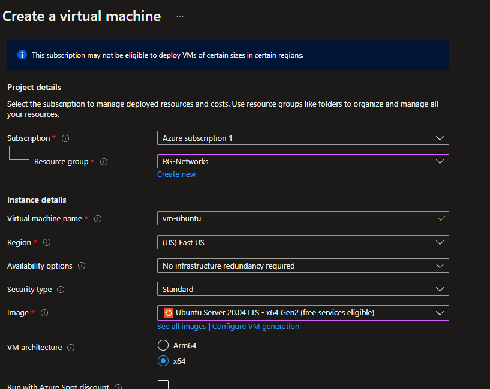

Observe Your Virtual Network within Network Watcher:

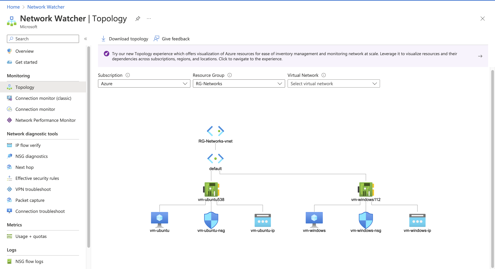

Now let's observe some ICMP traffic

Remote into your Windows 10 Virtual Machine, install Wireshark, open it and filter for ICMP traffic only. 

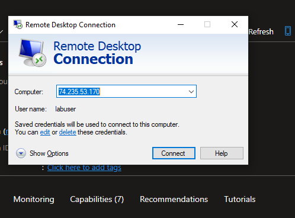

Retrieve the private IP address of the Ubuntu VM and attempt to ping it from within the Windows 10 VM. Observe ping requests and replies within WireShark:

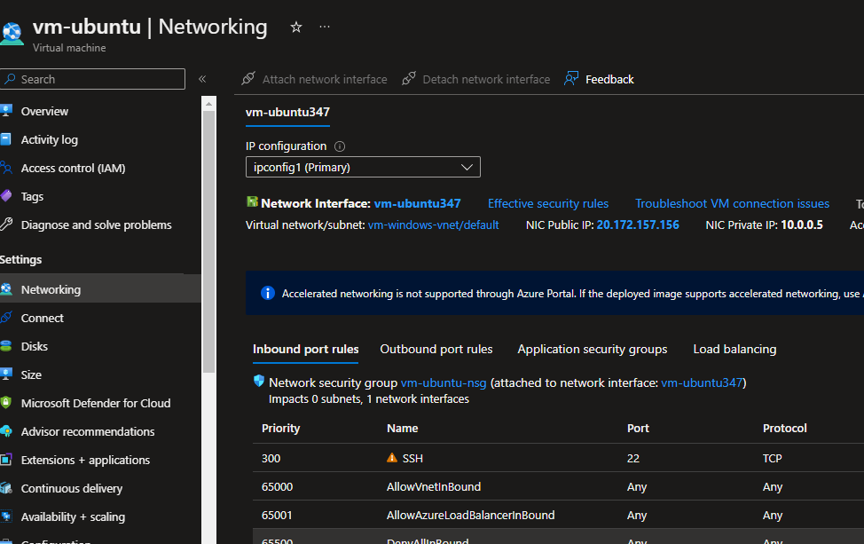

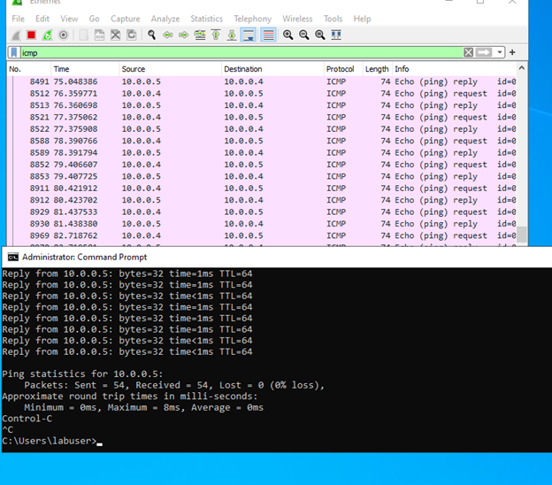

Attempt to ping a public website (such as www.google.com) and observe the traffic in WireShark:

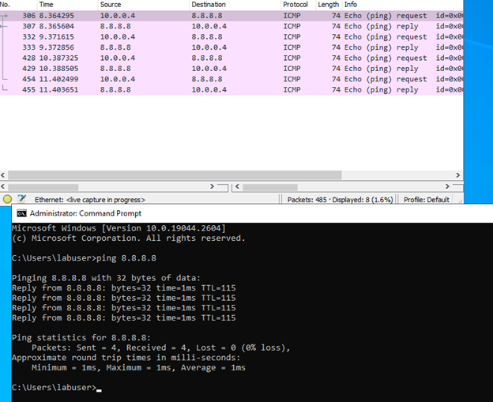

Initiate a perpetual/non-stop ping from your Windows 10 VM to your Ubuntu VM:

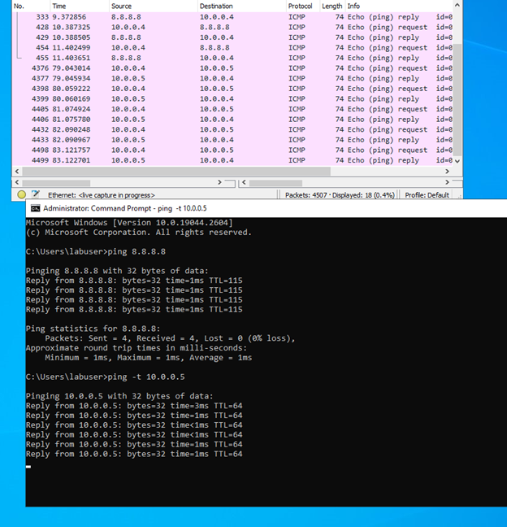

Open the Network Security Group your Ubuntu VM is using and disable incoming (inbound) ICMP traffic, while back in the Windows 10 VM, observe the ICMP traffic in WireShark and the command line Ping activity:

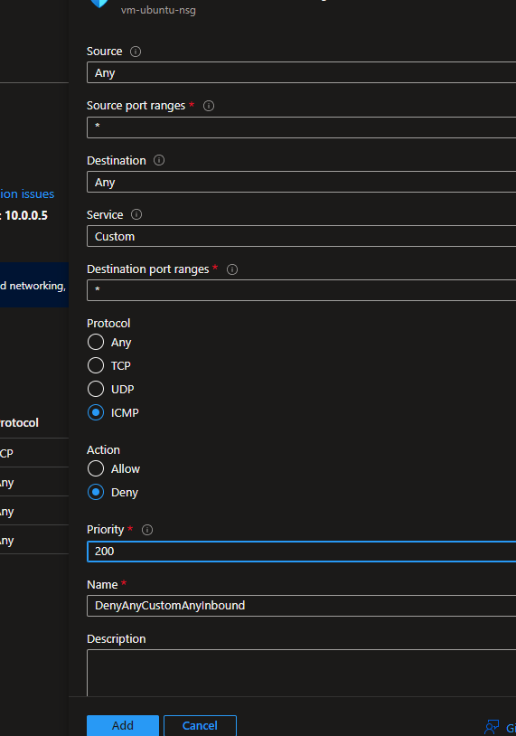

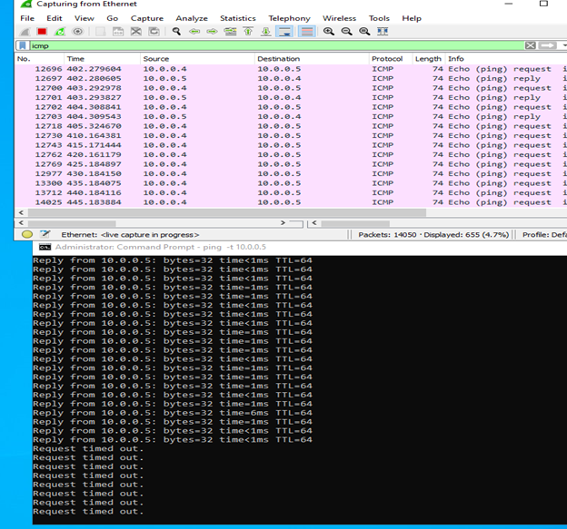

Re-enable ICMP traffic for the Network Security Group in your Ubuntu VM and back in the Windows 10 VM, observe the ICMP traffic in WireShark and the command line ping activity (should start working again).Finally, stop the ping activity:

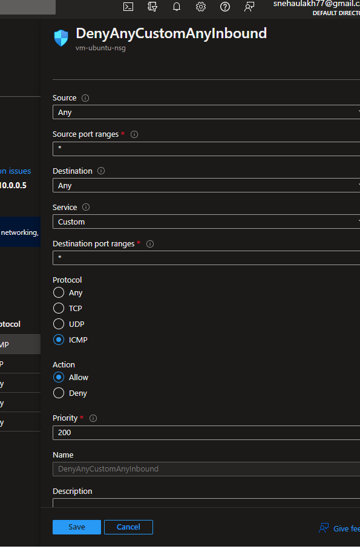

Time to observe SSH traffic

Back in Wireshark, filter for SSH traffic only and from your Windows 10 VM, “SSH into” your Ubuntu virtual machine (via its private IP address). Type commands (ls, pwd, etc) into the linux SSH connection and observe SSH traffic spam in WireShark.

Exit the SSH connection by typing ‘exit’ and pressing [return]:

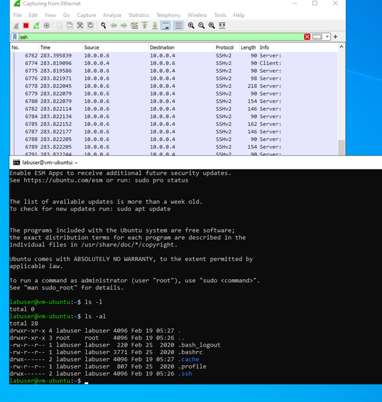

And why not observe DHCP Traffic now

Back in Wireshark, filter for DHCP traffic only. From your Windows 10 VM, attempt to issue your VM a new IP address from the command line (ipconfig /renew)

Observe the DHCP traffic appearing in WireShark:

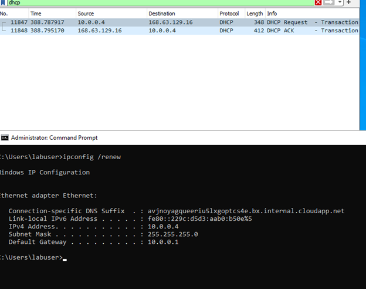

Let's observe DNS traffic next

Back in Wireshark, filter for DNS traffic only.

From your Windows 10 VM within a command line, use nslookup to see what google.com and disney.com’s IP addresses are and observe the DNS traffic being shown in WireShark:

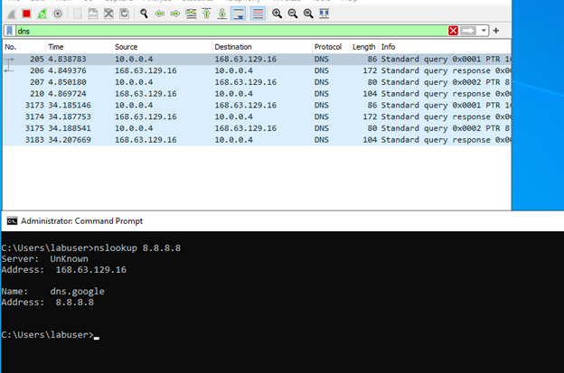

And finally, we will observe RDP traffic to finish up this tutorial

Back in Wireshark, filter for RDP traffic only (tcp.port == 3389).

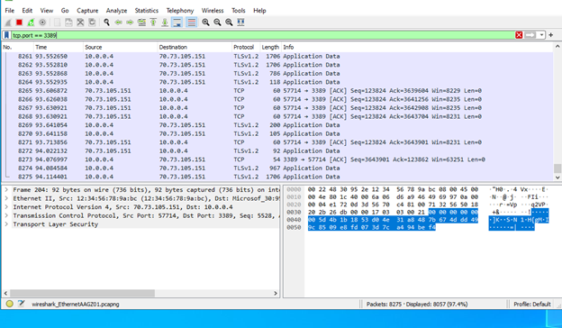

:bulb: Do not forget to clean up your environment in Azure 
